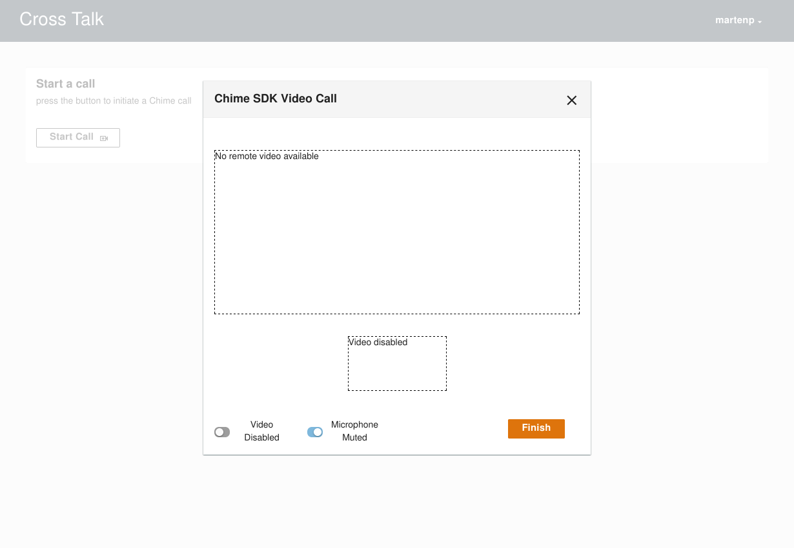

# Cross Talk - Amazon Chime SDK Video Chat and AWS AppSync Local Resolver Sample

## Overview
This repository contains source code for the full "Cross Talk" video chat Chime SDK sample.

It consists of three core modules:

- Infra: This defines the infrastructure as code using the Cloud Development Kit (CDK).
- Lambdas: This contains the code which is deployed into a Lambda function defined in the Infra
- Website: A React website for Cross Talk UI

This sample aims to demonstrate a number of things:
- Simple useage of the awesome new Chime SDK React components (https://github.com/aws/amazon-chime-sdk-component-library-react). The code in "Website/src/components/ModalChimeDialog.tsx" illustrates this.
- An example of how to use the AppSync "None" data approach to resolvers to provide a direct pub/sub notification system over GraphQL without having persistent storage of the mutations (https://docs.aws.amazon.com/appsync/latest/devguide/resolver-mapping-template-reference-none.html). The client-side interaction with AppSync is shown in "Website/src/containers/Home/HomeContainer.tsx", with the AppSync resolvers configured in "Infra/lib/stack/AppSyncStack.ts". The diagram below shows the way the front-end utilises the local resolver to notify GraphQL subscribers of mutations to the local resolver:

<p align="center"></p>

In addition to these points, this sample utilises the recently released NorthStar design system (https://northstar.aws-prototyping.cloud/) and the AWS Cloud Development Kit (https://aws.amazon.com/cdk/) for the deployment of all infrastructure.

The application implements a simple broadcast chat user interface, where a logged in user can initiate a chat with any interested user by clicking on the "Start Chat" button. Other active users will see an alert advertising this chat request (this is implemented using the AppSync local resolver subscription). The first user to accept the chat request will "claim" that invitation, causing the alert to be removed for any other active uers.


The Chime SDK chat dialog that is displayed defaults to having the audio active and video inactive. These can be toggled via the buttons shown in the screenshot below:



The key services utilised by this sample are shown in the simple architecture diagram below:

<p align="center"></p>

## Bootstrap/Build/Deploy/Run
Once you have locally cloned this repository, and assuming you have
- an active AWS account

- installed the current version of the AWS CLI

- you have NodeJS 12 or greater installed

- installed the current version of the AWS CLI

  (this can be done by typing "npm i -g aws-cdk" in your preferred shell terminal session)

### Bootstrap
You only need to do this one time per environment where you want to deploy CDK applications.
If you’re unsure whether your environment has been bootstrapped already, you can always run
the command again.

Make sure you have credentials for **ACCOUNT** (replace with your AWS account ID) in a profile
named **account-profile**. For more information, see [Named profiles](https://docs.aws.amazon.com/cli/latest/userguide/cli-configure-profiles.html).

Run the following command in this `Infra` directory:

```sh
npm install
cdk bootstrap \
  --profile account-profile \
  --cloudformation-execution-policies arn:aws:iam::aws:policy/AdministratorAccess \
  aws://ACCOUNT1/ap-southeast-2
```

### Build/Deploy
A convenience script is provided to deploy all infrastructure to your environment. This builds
all the lambdas, the website, the infrastructure and then initiates the CDK deployment. From the "Infra" directory, you can run:

```
./deployStack.sh --profile <your_account_profile>
```

### Run

Once the deployment has finished, you can open the CloudFront URL printed by the deployment script or run from a local Node session. To run a local instance of the React front-end, you will need to grab a copy of the "runtime-config.js" file that the CDK deployment process created (in the S3 static website bucket) and copy it to "Website/public".


## Security

See [CONTRIBUTING](CONTRIBUTING.md#security-issue-notifications) for more information.

## License

This library is licensed under the MIT-0 License. See the [LICENSE](LICENSE.txt) file.
